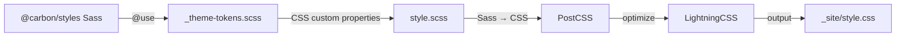
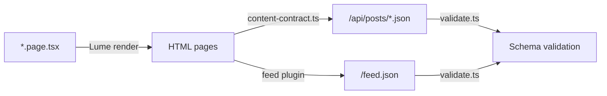
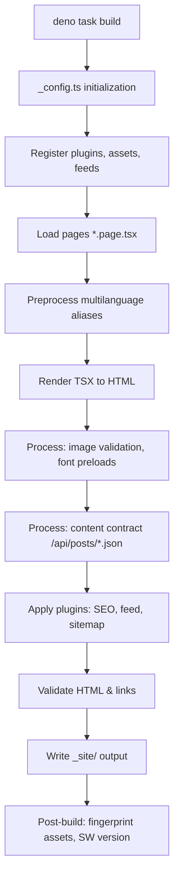

# Architecture

normco.re is a personal blog built as a static site. It solves the need for a
fast, accessible, and multilingual publishing platform with zero client-side
JavaScript overhead. The site is generated at build time by the Lume static site
generator, running on the Deno runtime.

## Overview

The project follows a functional, data-driven architecture. Content and
configuration are defined as TypeScript modules. Pages are rendered as TSX
components that receive data from the build pipeline. The build process produces
static HTML, CSS, and minimal JavaScript for progressive enhancement only.

## Source map

```
normco.re/
├── _config.ts                 # Lume site configuration — build pipeline entry point
├── _config/                   # Split configuration modules
│   ├── plugins.ts             # Lume plugin registrations
│   ├── assets.ts              # Script and stylesheet registration
│   ├── feeds.ts               # Multilingual feed configurations
│   └── processors.ts         # HTML/XML processors and content contract
├── _cms.ts                    # LumeCMS configuration for local content editing
├── deno.json                  # Deno configuration, imports, and task definitions
├── contracts/                 # Content contract schemas and validation
│   ├── post.schema.json       # JSON Schema for structured post blocks
│   ├── feed.schema.json       # JSON Schema for JSON Feed 1.1 output
│   └── validate.ts            # Post-build schema validation script
├── design-tokens/             # Figma variable exports (legacy, superseded by @carbon/styles Sass)
├── plugins/                   # Custom Lume plugins
│   ├── content-contract.ts    # Generates /api/posts/*.json from rendered HTML
│   ├── console_debug.ts       # Console debug levels via LUME_LOGS
│   └── otel.ts                # OpenTelemetry build instrumentation
├── scripts/                   # Build automation and maintenance scripts
├── src/
│   ├── _data.ts               # Site-wide data (author, site name, i18n overrides)
│   ├── index.page.tsx         # Home page component
│   ├── about.page.tsx         # About page component
│   ├── 404.page.tsx           # 404 page component
│   ├── style.scss             # Global Sass entry point (layer imports)
│   ├── _components/           # Reusable UI components (Header, Footer, PostCard, …)
│   ├── _includes/layouts/     # Layout wrappers (base.tsx, post.tsx)
│   ├── posts/                 # Blog posts (*.page.tsx) and post-related utilities
│   ├── scripts/               # Client-side JavaScript (progressive enhancement)
│   ├── styles/                # Sass partials, design tokens, and components
│   │   ├── carbon/            # Carbon Sass foundation modules
│   │   │   ├── _config.scss   # @carbon/styles config ($prefix, $css--font-face: false)
│   │   │   ├── _theme-tokens.scss  # Theme tokens via @carbon/styles/scss/theme
│   │   │   └── _grid.scss     # Carbon 2x CSS Grid system
│   │   ├── editorial/         # Site-specific convenience token aliases
│   │   │   └── _tokens.scss   # Maps --space-* to --cds-spacing-*, etc.
│   │   ├── _reset.scss        # CSS reset
│   │   ├── _base.scss         # Typography and element styles
│   │   ├── _layout.scss       # Carbon UI Shell layout (header, sidenav, footer)
│   │   ├── components/        # Per-component SCSS files
│   │   └── _utilities.scss    # Accessibility utilities
│   └── utils/                 # Pure utility functions (i18n, formatting, validation)
└── ios/                       # SwiftUI native app (peer project, shares no Deno code)
```

## Core modules

### Configuration layer

- **`_config.ts`**: Orchestrates the Lume site (~120 lines). Delegates to split
  modules in `_config/` for plugin registration, asset pipelines, feed
  configuration, and HTML/XML processors.
- **`_data.ts`**: Exports site-wide constants and internationalization
  overrides. Available to all pages and layouts through Lume's data cascade.
- **`_cms.ts`**: Defines LumeCMS collections and uploads for local content
  editing.

### Rendering layer

- **Pages (`*.page.tsx`)**: Export metadata (title, date, layout) and a default
  TSX render function. Receive page data and helpers as arguments.
- **Layouts (`_includes/layouts/*.tsx`)**: Wrap page content with shared HTML
  structure (head, header, footer, navigation). Use the `children` prop to
  inject page content.
- **Components (`_components/*.tsx`)**: Reusable UI fragments (Header, Footer,
  PostCard). Consumed via the `comp` variable provided by Lume, not direct
  imports.

### Data and internationalization

- **Multilanguage support**: The site supports English, French, Simplified
  Chinese, and Traditional Chinese. Language overrides are defined in `_data.ts`
  using camelCase keys (`fr`, `zhHans`, `zhHant`), aliased to hyphenated codes
  (`zh-hans`, `zh-hant`) at preprocess time.
- **Utilities (`src/utils/`)**: Pure functions for language tag resolution, URL
  localization, date formatting, and reading time calculation.

### Asset pipeline

- **CSS**: `style.scss` imports layered Sass partials from `src/styles/` using
  `@layer tokens, reset, base, layout, components, utilities`. Compiled by the
  Lume Sass plugin (with `loadPaths: ["node_modules"]`), then processed by
  PostCSS and LightningCSS (browser targeting).
- **JavaScript**: Client-side scripts in `src/scripts/` are minified by Terser.
  Service Worker (`sw.js`) is a single self-contained file.
- **Fonts**: IBM Plex Sans and IBM Plex Mono served locally via the Lume
  `google_fonts` plugin. Critical font preloads injected dynamically by a
  build-time processor.
- **Images**: Editorial images are validated for explicit dimensions to prevent
  Cumulative Layout Shift (CLS).

## CSS architecture — Carbon Design System v11

The site uses **Carbon Sass modules** (`@carbon/styles`) as the single source of
truth for design tokens. Sass is compiled at build time by the Lume Sass plugin;
no CSS-in-JS or client-side npm imports exist.



### Design token flow

1. **Carbon Sass modules** (`@carbon/styles/scss/theme`, `themes`, `spacing`,
   `motion`): Authoritative source for all design tokens.
2. **Theme tokens** (`src/styles/carbon/_theme-tokens.scss`): Uses
   `@include theme.theme()` to emit Carbon theme tokens as CSS custom properties.
   Configures White (light), Gray 90 (dark), and Gray 100 (high contrast) themes.
3. **Editorial tokens** (`src/styles/editorial/_tokens.scss`): Site-specific
   convenience aliases mapping `--space-*` to `--cds-spacing-*`, etc.
4. **Carbon 2x Grid** (`src/styles/carbon/_grid.scss`): Imports
   `@carbon/styles/scss/grid` to emit the full CSS Grid system with responsive
   4/8/16 column breakpoints.
5. **Cascade layers**:
   `@layer tokens, reset, base, layout, components, utilities` — strict
   ordering via import sequence.

### Component styling

UI components use Carbon `cds--` class conventions (Carbon v11 prefix) for the
UI Shell (header, sidenav, panels) and site-specific classes for content
components. Each component has its own SCSS file in `src/styles/components/`.

## Content contract

The build generates structured JSON endpoints for native app consumption:

- **`/api/posts/{slug}.json`**: Per-post structured block representation
  (paragraph, heading, code, image, quote, list blocks).
- **Language variants**: `/fr/api/posts/*.json`, `/zh-hans/api/posts/*.json`,
  `/zh-hant/api/posts/*.json`.
- **Schemas**: `contracts/post.schema.json` (post blocks) and
  `contracts/feed.schema.json` (JSON Feed 1.1).
- **Validation**: `deno task validate-contracts` validates build output against
  schemas.



## Build pipeline



## Architectural invariants

1. **TypeScript everywhere**: All content, layouts, components, and utilities
   are authored in TypeScript. Markdown is only an authoring-time format for
   LumeCMS and must be converted to TSX before commit.
2. **No runtime CSS-in-JS**: All styling is done via static CSS. Client-side
   JavaScript never injects or modifies styles.
3. **Functional core, imperative shell**: Business logic (data transforms,
   formatting, sorting) is implemented as pure functions in `src/utils/`. TSX
   files contain rendering logic only.
4. **Zero JavaScript by default**: Client-side scripts are optional
   enhancements. The site is fully functional without JavaScript.
5. **Named exports only**: All modules use named exports. `export default` is
   reserved for Lume render entry points (pages, layouts, components).
6. **No barrel files**: Direct imports are preferred. `mod.ts` is used only for
   narrow, intentional public APIs.
7. **Single source of truth for tokens**: All design tokens are derived from
   `@carbon/styles` Sass modules, emitted as CSS custom properties in
   `_theme-tokens.scss`. No other file redefines token values.

## Cross-cutting concerns

### Accessibility

- Semantic HTML with proper landmark roles (`<header>`, `<main>`, `<nav>`,
  `<article>`, `<footer>`).
- WCAG 2.2 AA color contrast ratios.
- `:focus-visible` styles on all interactive elements.
- `prefers-reduced-motion`, `prefers-color-scheme`, `prefers-contrast`, and
  `forced-colors` media queries supported.
- Skip-to-content link for keyboard navigation.

### Performance

- **Core Web Vitals**: Explicit image dimensions, locally hosted IBM Plex fonts,
  critical font preloads, minimal JavaScript.
- **Caching**: Fingerprinted asset URLs with long-lived cache headers. Service
  Worker for offline support.
- **CLS**: All editorial images enforce `width` and `height` attributes at build
  time.

### Validation

- **Type checking**: `deno task check` validates the entire codebase.
- **HTML validation**: `validateHtml` plugin checks generated HTML.
- **Link validation**: `checkUrls` plugin detects broken internal links.
- **SEO validation**: `seo` plugin reports missing titles, descriptions, and
  image alt attributes.
- **Content contracts**: `deno task validate-contracts` validates generated JSON
  against schemas.

## Dependencies

| Category            | Package                        | Purpose                                                        |
| ------------------- | ------------------------------ | -------------------------------------------------------------- |
| Runtime             | Deno 2.x                       | TypeScript runtime, package manager, and test runner           |
| SSG                 | Lume 3.x                       | Static site generation, plugin system, and build orchestration |
| CMS                 | LumeCMS 0.14.x                 | Local content editing interface                                |
| Design system       | @carbon/styles (Sass)          | Design tokens, themes, grid, and component patterns            |
| Fonts               | IBM Plex (via google_fonts)    | Locally hosted typeface for Carbon Design System               |
| Icons               | Carbon icons (inline SVG)      | SVG icon paths defined in `carbon-icons.ts`                    |
| Date                | date-fns                       | Date formatting with i18n locales                              |
| Syntax highlighting | Prism.js                       | Code block highlighting                                        |
| Search              | Pagefind                       | Client-side search index and UI                                |
| Telemetry           | OpenTelemetry                  | Build observability (optional)                                 |

## Key design principles

1. **Clarity over magic**: Explicit code is preferred to clever abstractions.
2. **Immutability**: Configuration objects use `as const satisfies Type` for
   deep immutability and narrow inference.
3. **Composability**: Complex pages are built by composing small, pure template
   functions.
4. **Progressive enhancement**: JavaScript enhances functionality but is never
   required.
5. **Minimalism**: Visual design prioritizes typography, whitespace, and content
   readability.

## Entry points

| Task               | Command                        | Description                                     |
| ------------------ | ------------------------------ | ----------------------------------------------- |
| Build              | `deno task build`              | Production build to `_site/`                    |
| Serve              | `deno task serve`              | Local development server with hot reload        |
| Type check         | `deno task check`              | Validate TypeScript types                       |
| Test               | `deno test`                    | Run unit and integration tests                  |
| Lint docs          | `deno task lint:doc`           | Validate JSDoc comments                         |
| Test docs          | `deno task test:doc`           | Run JSDoc code examples as tests                |
| Validate contracts | `deno task validate-contracts` | Validate generated JSON against content schemas |
| Lint commit        | `deno task lint-commit`        | Validate commit message (Conventional Commits)  |

## Service Worker

The Service Worker (`src/scripts/sw.js`) is a single self-contained file
implementing three caching strategies:

- **Cache-first**: Static assets (CSS, JS, fonts, images) with fingerprinted
  URLs.
- **Network-first**: HTML pages with multilingual offline fallback.
- **Stale-while-revalidate**: Feeds (RSS and JSON) with a 30-minute TTL.

Registration is handled by `sw-register.js` using `{ type: "module" }`.
