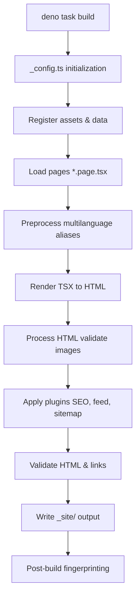

# Architecture

normco.re is a personal blog built as a static site. It solves the need for a fast, accessible, and multilingual publishing platform with zero client-side JavaScript overhead. The site is generated at build time by the Lume static site generator, running on the Deno runtime.

## Overview

The project follows a functional, data-driven architecture. Content and configuration are defined as TypeScript modules. Pages are rendered as TSX components that receive data from the build pipeline. The build process produces static HTML, CSS, and minimal JavaScript for progressive enhancement only.

## Source map

```
turbo-fiesta/
├── _config.ts                 # Lume site configuration — build pipeline entry point
├── _cms.ts                    # LumeCMS configuration for local content editing
├── deno.json                  # Deno configuration, imports, and task definitions
├── src/
│   ├── _data.ts               # Site-wide data (author, site name, i18n overrides)
│   ├── index.page.tsx         # Home page component
│   ├── about.page.tsx         # About page component
│   ├── 404.page.tsx           # 404 page component
│   ├── style.css              # Global CSS entry point
│   ├── _components/           # Reusable UI components (Header, Footer, PostCard, …)
│   ├── _includes/layouts/     # Layout wrappers (base.tsx, post.tsx)
│   ├── posts/                 # Blog posts (*.page.tsx) and post-related utilities
│   ├── scripts/               # Client-side JavaScript (progressive enhancement)
│   ├── styles/                # CSS partials and design tokens
│   └── utils/                 # Pure utility functions (i18n, formatting, validation)
├── plugins/                   # Custom Lume plugins (OpenTelemetry, console debug)
└── scripts/                   # Build automation and maintenance scripts
```

## Core modules

### Configuration layer

- **`_config.ts`**: Instantiates the Lume site, registers plugins, defines asset pipelines, and orchestrates the build. All Lume plugins (SEO, feed, sitemap, multilanguage, validation) are configured here.
- **`_data.ts`**: Exports site-wide constants and internationalization overrides. Available to all pages and layouts through Lume's data cascade.
- **`_cms.ts`**: Defines LumeCMS collections and uploads for local content editing.

### Rendering layer

- **Pages (`*.page.tsx`)**: Export metadata (title, date, layout) and a default TSX render function. Receive page data and helpers as arguments.
- **Layouts (`_includes/layouts/*.tsx`)**: Wrap page content with shared HTML structure (head, header, footer, navigation). Use the `children` prop to inject page content.
- **Components (`_components/*.tsx`)**: Reusable UI fragments (Header, Footer, PostCard). Consumed via the `comp` variable provided by Lume, not direct imports.

### Data and internationalization

- **Multilanguage support**: The site supports English, French, Simplified Chinese, and Traditional Chinese. Language overrides are defined in `_data.ts` using camelCase keys (`fr`, `zhHans`, `zhHant`), aliased to hyphenated codes (`zh-hans`, `zh-hant`) at preprocess time.
- **Utilities (`src/utils/`)**: Pure functions for language tag resolution, URL localization, date formatting, and reading time calculation.

### Asset pipeline

- **CSS**: `style.css` imports layered partials from `src/styles/`. Processed by PostCSS (imports), PurgeCSS (unused selector removal, currently disabled), and LightningCSS (minification and browser targeting).
- **JavaScript**: Client-side scripts in `src/scripts/` are minified by Terser. Service Worker modules are bundled separately.
- **Images**: Editorial images are validated for explicit dimensions to prevent Cumulative Layout Shift (CLS).

## Build pipeline



## Architectural invariants

1. **TypeScript everywhere**: All content, layouts, components, and utilities are authored in TypeScript. Markdown is only an authoring-time format for LumeCMS and must be converted to TSX before commit.
2. **No runtime CSS-in-JS**: All styling is done via static CSS. Client-side JavaScript never injects or modifies styles.
3. **Functional core, imperative shell**: Business logic (data transforms, formatting, sorting) is implemented as pure functions in `src/utils/`. TSX files contain rendering logic only.
4. **Zero JavaScript by default**: Client-side scripts are optional enhancements. The site is fully functional without JavaScript.
5. **Named exports only**: All modules use named exports. `export default` is reserved for Lume render entry points (pages, layouts, components).
6. **No barrel files**: Direct imports are preferred. `mod.ts` is used only for narrow, intentional public APIs.

## Cross-cutting concerns

### Accessibility

- Semantic HTML with proper landmark roles (`<header>`, `<main>`, `<nav>`, `<article>`, `<footer>`).
- WCAG 2.2 AA color contrast ratios.
- `:focus-visible` styles on all interactive elements.
- `prefers-reduced-motion`, `prefers-color-scheme`, and `prefers-contrast` media queries supported.

### Performance

- **Core Web Vitals**: Explicit image dimensions, system fonts only, critical CSS inlined, minimal JavaScript.
- **Caching**: Fingerprinted asset URLs with long-lived cache headers. Service Worker for offline support.
- **CLS**: All editorial images enforce `width` and `height` attributes at build time.

### Validation

- **Type checking**: `deno task check` validates the entire codebase.
- **HTML validation**: `validateHtml` plugin checks generated HTML against html-validate rules.
- **Link validation**: `checkUrls` plugin detects broken internal links and hash anchors.
- **SEO validation**: `seo` plugin reports missing titles, descriptions, and image alt attributes.

## Dependencies

| Category | Package | Purpose |
|----------|---------|---------|
| Runtime | Deno 2.x | TypeScript runtime, package manager, and test runner |
| SSG | Lume 3.x | Static site generation, plugin system, and build orchestration |
| CMS | LumeCMS 0.14.x | Local content editing interface |
| UI | Carbon Design System (partial) | Design tokens and component reference |
| Icons | Primer Octicons | SVG icon catalog rendered inline |
| Date | date-fns | Date formatting with i18n locales |
| Syntax highlighting | Prism.js | Code block highlighting |
| Search | Pagefind | Client-side search index and UI |
| Telemetry | OpenTelemetry | Build observability (optional) |

## Key design principles

1. **Clarity over magic**: Explicit code is preferred to clever abstractions.
2. **Immutability**: Configuration objects use `as const satisfies Type` for deep immutability and narrow inference.
3. **Composability**: Complex pages are built by composing small, pure template functions.
4. **Progressive enhancement**: JavaScript enhances functionality but is never required.
5. **Minimalism**: Visual design prioritizes typography, whitespace, and content readability.

## Entry points

| Task | Command | Description |
|------|---------|-------------|
| Build | `deno task build` | Production build to `_site/` |
| Serve | `deno task serve` | Local development server with hot reload |
| Type check | `deno task check` | Validate TypeScript types |
| Test | `deno test` | Run unit and integration tests |
| Lint docs | `deno task lint:doc` | Validate JSDoc comments |
| Test docs | `deno task test:doc` | Run JSDoc code examples as tests |

## Service Worker architecture

The Service Worker is split into modular files for maintainability:

- **`sw-core.js`**: Cache strategies and fetch handlers.
- **`sw-routing.js`**: Route definitions and request matching.
- **`sw-lifecycle.js`**: Install, activate, and cleanup handlers.
- **`sw-register.js`**: Registration script included in the base layout.

Modules are composed into `sw.js` at build time via the `_config.ts` post-build hook.
