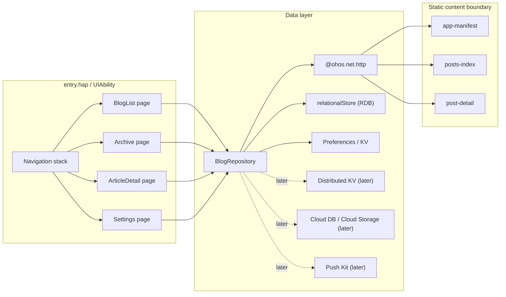

# HarmonyOS Roadmap

This document defines the recommended HarmonyOS direction for a native normco.re
client.

Updated: 2026-03-21

HarmonyOS remains a later client track, but the architecture and product
direction should already be explicit. Android is now the reference implemented
native client for the shared contract family; HarmonyOS should reuse that
content boundary and adapt it to native HarmonyOS patterns rather than invent a
parallel feed path.

## Executive Summary

- Build the HarmonyOS app as a 100% native HarmonyOS NEXT client.
- Use ArkTS + ArkUI + the Stage model as the baseline stack.
- Consume the same static JSON contract family used by the other native clients:
  - `app-manifest`
  - localized `posts-index`
  - localized `post-detail`
- Keep the first HarmonyOS version offline-first with local persistence before
  introducing distributed or cloud sync.
- Treat Super Device continuity, distributed sync, Cloud DB, and Push Kit as
  later layers on top of a stable local reader, not as Phase 0 requirements.

## Design-System Direction

- Use HarmonyOS Design as the platform design-system reference.
- Use HarmonyOS native components and patterns as the baseline for the client.
- The HarmonyOS client should feel native to HarmonyOS and should not try to
  reproduce the web site’s Carbon layer.

## Product Bar

Recommended first useful HarmonyOS version:

- native home feed
- native archive
- native article detail
- settings
- cached localized indexes
- cached opened posts
- per-device bookmarks
- per-device reading progress
- share and "Open in Browser"

Recommended later phases:

- distributed favorites and reading progress across nearby devices
- continuation between phone, tablet, watch, and car surfaces
- cloud-backed restore and sync
- push notifications for new posts

## Architecture Blueprint

## Recommended Stack

### Runtime And App Structure

- HarmonyOS NEXT 5.x baseline when implementation starts
- ArkTS
- ArkUI declarative UI
- Stage model
- `entry` HAP with a single `UIAbility` as the initial application shape
- one or two HSP utility modules only when shared code pressure appears
- prefer HSP over HAR for app-internal shared runtime code when modularization
  starts

### Language And Build Constraints

- treat ArkTS as a strict, explicit application language rather than as
  browser-style TypeScript
- keep contract decoding models explicit and stable
- avoid dynamic object-shape patterns and loose typing in app architecture
- optimize for AOT-friendly code paths and predictable startup cost

### UI Layer

- ArkUI native components
- `Navigation` as the preferred routing model for non-trivial flows
- `List` + `LazyForEach` for long feeds
- `Refresh` for pull-to-refresh
- adaptive layout rules for phone and tablet first
- watch and car only after the phone/tablet reader is stable

### State And Data

- page-local state kept light and granular
- app-wide state kept explicit and minimal
- `@ohos.net.http` for network access
- `relationalStore` as the primary local cache for content
- Preferences / lightweight KV storage for settings and small local state
- distributed KV only when cross-device sync becomes a real product need
- Cloud DB / Cloud Storage only when cross-session restore or remote sync is
  worth the added complexity

## Data Strategy For normco.re

The HarmonyOS app should follow the same contract-first rule as the other native
clients.

Use:

- static JSON generated by the current Deno + Lume build
- stable CDN-served URLs
- offline-first local caching in the app
- native rendering of structured content blocks for article detail

Do not start from:

- RSS as the primary app API
- rendered HTML pages
- a WebView-first article renderer
- a HarmonyOS-specific content backend
- Deno KV inside the site build

The repository already owns the editorial source of truth. HarmonyOS should
consume the same generated contracts instead of inventing a parallel feed path.

## HarmonyOS-Specific Guidance

### Navigation

- prefer `Navigation` for the real app
- use legacy router APIs only for throwaway prototypes or compatibility bridges
- plan the article route around the canonical post URL and an app-level article
  identifier

### Local Persistence

Start with:

- RDB for article summaries, details, and offline cache metadata
- Preferences / lightweight KV for user settings and small state

Add later:

- distributed KV for nearby-device favorites and reading progress
- cloud-backed sync for restore and continuity across non-simultaneous devices

### Performance

Target outcomes:

- 120 Hz-class smooth long-list scrolling on capable hardware
- no heavy parsing or image decoding in the UI build path
- stable keys for list items
- aggressively lazy rendering
- compressed media and conservative package size
- performance decisions validated on real devices rather than assumed from
  ecosystem benchmarks

Practical rules:

- keep feed cells visually rich but computationally cheap
- do network and parsing work outside the page build path
- pre-cache or pre-decode only what is needed for the next screenful
- treat watch and car layouts as separate adaptation work, not as free bonuses
- use DevEco profiling and device testing before trusting performance claims

### Super Device And Continuity

Super Device value is real for this product, but it should not block the first
reader release.

Recommended order:

1. ship a strong phone reader
2. adapt for tablet / foldable layouts
3. add distributed favorites / reading progress
4. add continuation and handoff flows
5. add cloud-backed restore only if the product value is proven

## Delivery Phases

### Phase 0: Prep

- reserve the HarmonyOS application identifier / namespace
- decide the initial module layout (`entry` HAP first, HSP later if needed)
- confirm HarmonyOS Design as the design-system reference
- confirm contract-first consumption from the existing static API
- define the deep-link and route strategy for post URLs

### Phase 1: Prototype

- home feed
- archive
- detail page
- static contract decoding
- RDB-backed local cache
- pull-to-refresh

### Phase 2: Product Hardening

- settings and preferences
- offline cache policy
- adaptive tablet layout
- performance profiling
- UI and integration tests

### Phase 3: Distributed Features

- distributed KV for favorites / reading progress
- continuation across supported device classes
- cloud-backed restore and sync
- push notifications if they are product-justified

## References

- [HarmonyOS Design](https://developer.huawei.com/consumer/en/design/)
- [ArkUI](https://developer.huawei.com/consumer/cn/arkui/)
- [ArkTS](https://developer.huawei.com/consumer/en/arkts/)
- [Stage model overview](https://developer.huawei.com/consumer/cn/arkui/arkui-stage/)
